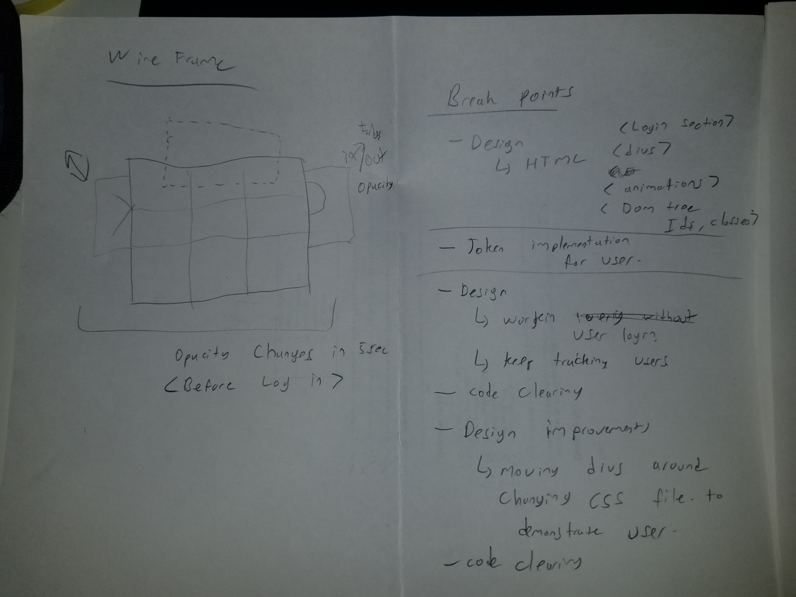
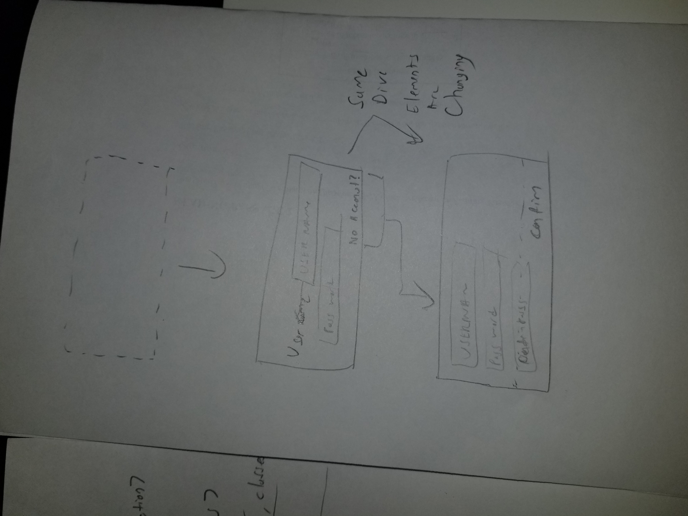

<!-- Pin your repository on GitHub as a Popular Repository
Complete the repository Description field and Website field with a meaningful sentence description of the application and link to the live URL github image
List technologies used
Document your planning and tell a story about your development process and problem-solving strategy.
List unsolved problems which would be fixed in future iterations.
Link to wireframes and user stories. -->

GitHub: https://github.com/selcuktoklucu/tic-tac-toe
Live URL: https://selcuktoklucu.github.io/tic-tac-toe/

This is a simply designed tic-tac-toe game, uses powerful user tracking system with connecting to an API server.
System provides these features:
-User security
-Getting user game History
-Update Game immediately
-Creating game sessions related to user

Strategies and planning: Game has several rules and algorithms. General rules applied to the game logic. For creating user, and using API, provided documents used.In my plan of this project, was creating a game mostly based on the browser, then publishing values to the API to keep track user data and games.

Unsolved Problems: Visual design is improvable. Also multiplayer section can be attachable to play only one user.

Tech Keywords: Single-Page-Application(SPA), HTML5, Javascript, Bootstrap 3, CSS3, API, JSON, JQuery, Git/Github, Authentication

Some user stories from my users!
1) As a father, I want to show possibilities of software to my 6 year-old kid
2) As a occasional player, I want to play with my mate without downloading an app
3) As a retailer store, I want to put something on my counter, that my customer's kid can play when parents are shopping
4) As a math teacher, I can show logic of algorithm to primary school kids

Wireframes

